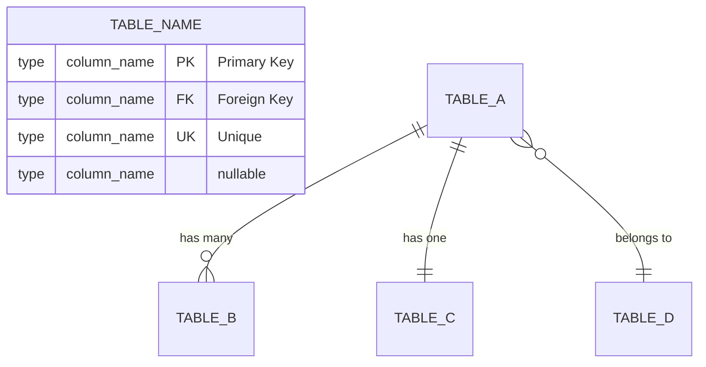
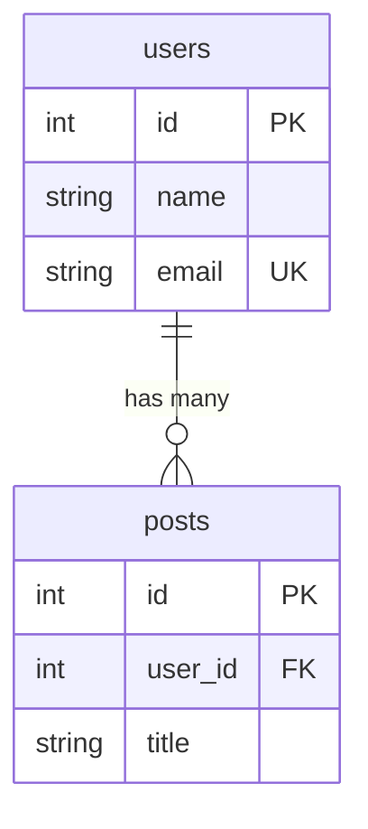

# Drizzle ERD Generator

Generate Mermaid ERD diagrams from Drizzle ORM schema files.

## When to Use

- Database schema visualization needed
- Understanding table relationships
- Documentation for DB structure
- PR review of schema changes

## Process

1. **Find schema files** - Locate Drizzle table definitions (usually `schema.ts` or `tables.ts`)
2. **Parse tables** - Extract table names, columns, types, and constraints
3. **Identify relations** - Find `.references()` calls and relations definitions
4. **Generate Mermaid** - Output ERD in Mermaid syntax

## Mermaid ERD Syntax



### Relationship Notation

| Symbol | Meaning      |
| ------ | ------------ |
| `\|\|` | Exactly one  |
| `o\|`  | Zero or one  |
| `}o`   | Zero or many |
| `}\|`  | One or many  |

### Type Mapping

| Drizzle        | Mermaid |
| -------------- | ------- |
| `text()`       | string  |
| `integer()`    | int     |
| `real()`       | float   |
| `blob()`       | blob    |
| `boolean` mode | boolean |

## Output Template

```mermaid
erDiagram
    %% Master Tables

    %% Transaction Tables

    %% Snapshot Tables

    %% Relations
```

## Example

From Drizzle:

```typescript
export const users = sqliteTable("users", {
  id: integer("id").primaryKey(),
  name: text("name").notNull(),
  email: text("email").unique(),
});

export const posts = sqliteTable("posts", {
  id: integer("id").primaryKey(),
  userId: integer("user_id").references(() => users.id),
  title: text("title").notNull(),
});
```

To Mermaid:



## Quick Reference

### Column Markers

- `PK` - primaryKey()
- `FK` - .references()
- `UK` - .unique()
- Add "nullable" comment if no .notNull()

### Grouping

Group related tables with Mermaid comments:

```mermaid
%% === Master Tables ===
%% === Transaction Tables ===
```
