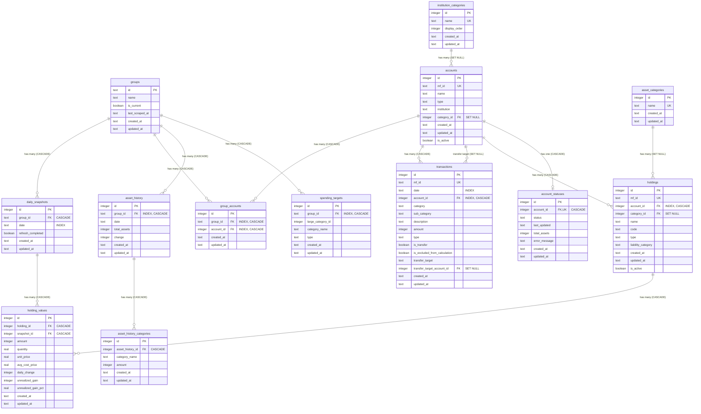

# Database Schema

## Indexes

| Table                    | Index                                         | Type   | Columns                         |
| ------------------------ | --------------------------------------------- | ------ | ------------------------------- |
| group_accounts           | group_accounts_group_account_idx              | UNIQUE | group_id, account_id            |
| group_accounts           | group_accounts_group_id_idx                   | INDEX  | group_id                        |
| group_accounts           | group_accounts_account_id_idx                 | INDEX  | account_id                      |
| daily_snapshots          | daily_snapshots_date_idx                      | INDEX  | date                            |
| holding_values           | holding_values_holding_snapshot_idx           | UNIQUE | holding_id, snapshot_id         |
| holdings                 | holdings_account_id_idx                       | INDEX  | account_id                      |
| accounts                 | accounts_category_id_idx                      | INDEX  | category_id                     |
| transactions             | transactions_date_idx                         | INDEX  | date                            |
| transactions             | transactions_account_id_idx                   | INDEX  | account_id                      |
| asset_history            | asset_history_group_date_idx                  | UNIQUE | group_id, date                  |
| asset_history            | asset_history_group_id_idx                    | INDEX  | group_id                        |
| asset_history_categories | asset_history_categories_history_category_idx | UNIQUE | asset_history_id, category_name |
| spending_targets         | spending_targets_group_category_idx           | UNIQUE | group_id, large_category_id     |
| spending_targets         | spending_targets_group_id_idx                 | INDEX  | group_id                        |

## ON DELETE Actions

| Parent Table           | Child Table              | Action   |
| ---------------------- | ------------------------ | -------- |
| accounts               | account_statuses         | CASCADE  |
| accounts               | holdings                 | CASCADE  |
| accounts               | transactions             | CASCADE  |
| accounts               | transactions (transfer)  | SET NULL |
| accounts               | group_accounts           | CASCADE  |
| groups                 | daily_snapshots          | CASCADE  |
| groups                 | group_accounts           | CASCADE  |
| groups                 | asset_history            | CASCADE  |
| groups                 | spending_targets         | CASCADE  |
| holdings               | holding_values           | CASCADE  |
| daily_snapshots        | holding_values           | CASCADE  |
| asset_history          | asset_history_categories | CASCADE  |
| institution_categories | accounts                 | SET NULL |
| asset_categories       | holdings                 | SET NULL |
